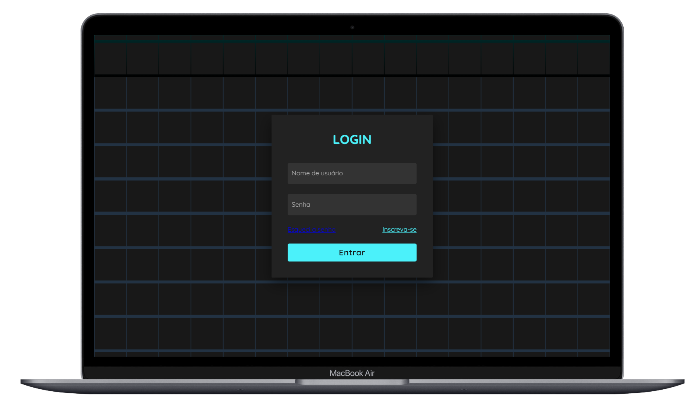

# TELA DE LOGIN
Trechos de códigos de uma tela de login, desenvolvido com 34.9% de variáveis CSS e 65.1% de elementos HTML.

# Meus Games:
- https://trechosgame.github.io/Jogo_Da_Forca/app.html
- https://trechosgame.github.io/Jogo-Quem-Sou-Eu/app.html
- https://trechosgame.github.io/Quiz-Responsivo/quiz.html

# Minhas Redes Sociais:
- https://www.instagram.com/trechosgame/
- https://wwwbehance.net/trechosgame
- https://www.colab55.com/@trechosdecodigo
- https://www.youtube.com/channel/UCfEsOEx_t6hiIms8HzttxOw/featured
- https://github.com/trechosgame
  
# CÓDIGO FONTE:
 - https://www.youtube.com/watch?v=0xpxZGJqBHU&t=76s

# Color Palette:
 - https://mycolor.space

# Editor de Imagens Online:
 - https://www.resizepixel.com/pt/edit

# Imagens:
- https://www.freepik.com/
- https://www.storyset.com/
- https://www.undraw.com/
- https://www.pixabay.com/
- https://www.unsplash.com/
- https://www.flaticon.com/
- https://www.pngegg.com/

